# BuyASpot Payment Flow Analysis

## 1. RAZORPAY PAYMENT VERIFICATION LOGIC

### Edge Functions
- **Location**: [supabase/functions/verify-razorpay-payment/index.ts](supabase/functions/verify-razorpay-payment/index.ts)
- **Location**: [supabase/functions/verify-marketplace-payment/index.ts](supabase/functions/verify-marketplace-payment/index.ts)

### Verification Process - Direct Pixel Purchase Flow

**File**: [supabase/functions/verify-razorpay-payment/index.ts](supabase/functions/verify-razorpay-payment/index.ts#L30-L42)

```typescript
// Verify Razorpay signature using HMAC SHA256
function verifySignature(
   orderId: string,
   paymentId: string,
   signature: string,
   secret: string
): boolean {
   const message = `${orderId}|${paymentId}`
   const hmac = createHmac('sha256', secret)
   hmac.update(message)
   const generatedSignature = hmac.digest('hex')
   return generatedSignature === signature
}
```

**Key Steps** (Lines 200-270):
1. Validate environment variables (Razorpay secret, Supabase credentials)
2. Extract and verify authorization header
3. Parse request body with `razorpay_order_id`, `razorpay_payment_id`, `razorpay_signature`
4. Verify HMAC SHA256 signature
5. Get payment order from database and verify ownership
6. Call `complete_pixel_purchase` RPC function
7. Send confirmation email via Resend
8. Return success response

### Error Handling in Verification:
- ❌ **Invalid signature**: Marks payment as 'failed' and throws error
- ❌ **Missing auth header**: Returns 401
- ❌ **Invalid token**: Returns 401
- ❌ **Payment order not found**: Returns error
- ❌ **Order already processed**: Returns error
- ❌ **Email send failures**: Logged but don't block payment completion

---

## 2. PURCHASE_PIXEL RPC & COMPLETE_PIXEL_PURCHASE RPC

### Types Definition
**File**: [src/integrations/supabase/types.ts](src/integrations/supabase/types.ts#L1183-L1200)

```typescript
purchase_pixel: {
  Args: {
    p_alt_text?: string
    p_image_url?: string
    p_link_url?: string
    p_x: number
    p_y: number
  }
  Returns: Json
}
purchase_pixels_block: {
  Args: {
    p_alt_text?: string
    p_image_url: string
    p_link_url?: string
    p_pixels: Json
  }
  Returns: Json
}
```

### purchase_pixel RPC (Direct single pixel)
**File**: [supabase/migrations/008_rpc_functions.sql](supabase/migrations/008_rpc_functions.sql#L48-L114)

```sql
CREATE OR REPLACE FUNCTION public.purchase_pixel(
  p_x INTEGER,
  p_y INTEGER,
  p_image_url TEXT DEFAULT NULL,
  p_link_url TEXT DEFAULT NULL,
  p_alt_text TEXT DEFAULT NULL
)
RETURNS JSONB
```

**Process**:
1. Validates user is authenticated
2. Validates pixel coordinates (0-99)
3. Calculates price using `calculate_pixel_price()`
4. Updates pixel: sets owner_id, image_url, link_url, alt_text, price_paid, purchased_at
5. Updates profile: increments pixel_count, total_spent
6. Logs event in audit table
7. Returns success with pixel details

**Status**: ⚠️ **NOT USED in checkout flow** - Only for direct RPC calls

### complete_pixel_purchase RPC (Multiple pixels with pre-validation)
**File**: [supabase/migrations/017_enhanced_payment_validation.sql](supabase/migrations/017_enhanced_payment_validation.sql#L11-L171)

```sql
CREATE OR REPLACE FUNCTION public.complete_pixel_purchase(
  p_payment_order_id UUID,
  p_razorpay_payment_id TEXT,
  p_razorpay_signature TEXT,
  p_image_url TEXT DEFAULT NULL,
  p_link_url TEXT DEFAULT NULL,
  p_alt_text TEXT DEFAULT NULL
)
RETURNS JSONB
```

**Critical Process** (Enhanced Validation):
1. **Pre-Validation**: Check all pixels are still available
   - Counts available pixels vs requested pixels
   - If mismatch: marks order as 'failed' and logs event
   - Returns detailed error with available_count and requested_count
2. **Update Payment Order**: Sets status to 'paid', stores Razorpay IDs, sets paid_at timestamp
3. **Process Pixels**:
   - Create pixel_block if multiple pixels (with payment_order_id reference)
   - Update all pixels atomically (owner_id, block_id, metadata, purchased_at, payment_order_id)
   - Verify all pixels were updated
4. **Update Profile**: Increment pixel_count and total_spent counters
5. **Log Event**: For audit trail

**Error Scenarios**:
```
- Pixels unavailable → Returns 'false' with error details
- Order not found → Returns error
- Order already processed → Returns error
- Partial update → Logs discrepancy
```

### FLOW BETWEEN FUNCTIONS

**File**: [supabase/functions/verify-razorpay-payment/index.ts](supabase/functions/verify-razorpay-payment/index.ts#L230-L245)

```typescript
const { data: purchaseResult, error: purchaseError } = await supabaseAdmin
   .rpc('complete_pixel_purchase', {
      p_payment_order_id: body.payment_order_id,
      p_razorpay_payment_id: body.razorpay_payment_id,
      p_razorpay_signature: body.razorpay_signature,
      p_image_url: body.image_url || paymentOrder.purchase_metadata?.image_url,
      p_link_url: body.link_url || paymentOrder.purchase_metadata?.link_url,
      p_alt_text: body.alt_text || paymentOrder.purchase_metadata?.alt_text,
   })
```

---

## 3. DIRECT PIXEL PURCHASE vs MARKETPLACE PURCHASE

### DIRECT PIXEL PURCHASE FLOW

**Entry Point**: [src/pages/BuyPixels.tsx](src/pages/BuyPixels.tsx#L465-L513)

**Step-by-step Flow**:

1. **Create Order** (Client-side in PurchasePreview.tsx)
   - File: [src/components/PurchasePreview.tsx](src/components/PurchasePreview.tsx#L367-L380)
   - Calls edge function: `create-razorpay-order`
   - Payload:
     ```typescript
     {
       pixels: [{x, y, price}, ...],
       totalAmount: number,
       imageUrl?: string,
       linkUrl?: string,
       altText?: string
     }
     ```

2. **Edge Function: create-razorpay-order**
   - File: [supabase/functions/create-razorpay-order/index.ts](supabase/functions/create-razorpay-order/index.ts#L80-L160)
   - Creates Razorpay order via API
   - Stores in `payment_orders` table with status='created'
   - Stores pixels array in `purchase_metadata`
   - Returns: order ID, razorpay_order_id, amount, key_id

3. **Razorpay Payment Modal**
   - Opens Razorpay checkout with order details
   - User completes payment
   - Razorpay returns response with signatures

4. **Verify & Complete**
   - File: [src/components/PurchasePreview.tsx](src/components/PurchasePreview.tsx#L400-L430)
   - Calls edge function: `verify-razorpay-payment`
   - Verifies signature in edge function
   - Calls RPC: `complete_pixel_purchase`
   - Returns ownership transfer result

5. **Email Confirmation**
   - Sends via Resend with purchase details
   - Includes pixel count, total amount, pixel name, link URL

---

### MARKETPLACE PIXEL PURCHASE FLOW

**Entry Point**: [src/pages/MarketplacePage.tsx](src/pages/MarketplacePage.tsx#L323-L400)

**Key Differences**:

1. **Create Order** 
   - File: [supabase/functions/create-marketplace-order/index.ts](supabase/functions/create-marketplace-order/index.ts#L15-L154)
   - Input: `listing_id` only
   - Fetches listing details from database
   - Verifies buyer ≠ seller
   - Stores in `payment_orders` with:
     - `purchase_type`: 'marketplace_purchase'
     - `purchase_metadata`: {listing_id, pixel_id, seller_id, asking_price, pixel_coords}

2. **Razorpay Order Creation**
   ```typescript
   // In create-marketplace-order
   amount: listing.asking_price * 100 (paise)
   notes: {
      user_id: user.id,
      listing_id: body.listing_id,
      seller_id: listing.seller_id,
      purpose: 'marketplace_purchase'
   }
   ```

3. **Payment Verification**
   - File: [supabase/functions/verify-marketplace-payment/index.ts](supabase/functions/verify-marketplace-payment/index.ts#L1-L356)
   - Calls RPC: `purchase_from_marketplace_verified`
   - Different RPC handles marketplace-specific logic

4. **Marketplace RPC: purchase_from_marketplace_verified**
   - File: [supabase/migrations/018_marketplace_payment.sql](supabase/migrations/018_marketplace_payment.sql#L40-L120)
   - Calculates 5% platform fee (0.05 coefficient)
   - Creates `marketplace_transactions` record
   - Transfers ownership of pixel from seller to buyer
   - Updates pixel: owner_id, times_resold counter, last_sale_price, last_sale_date
   - Records seller_net (sale_price - platform_fee)
   - Closes marketplace listing (status changes)

5. **Dual Email Notifications**
   - **Buyer**: Confirmation email with transaction ID
   - **Seller**: Sale notification with earnings breakdown

---

## 4. RETRY & RECONCILIATION MECHANISMS

### Current Retry Mechanisms

#### 1. Razorpay Payment Modal Retries
**File**: [src/components/PurchasePreview.tsx](src/components/PurchasePreview.tsx#L503-A507)

```typescript
retry: {
  enabled: true,
  max_count: 3,  // Allow up to 3 retry attempts
},
timeout: 900, // 15 minutes
```

#### 2. Razorpay Script Loading Retries
**File**: [src/components/PurchasePreview.tsx](src/components/PurchasePreview.tsx#L156-L180)

```typescript
let retries = 0;
const maxRetries = 3;

const loadScript = () => {
  const script = document.createElement('script');
  script.src = 'https://checkout.razorpay.com/v1/checkout.js';
  script.async = true;
  // ... error handler with retry
  script.onerror = () => {
    // Retry logic
  };
};
```

#### 3. Payment Order Timeout
**File**: [supabase/migrations/015_payment_integration.sql](supabase/migrations/015_payment_integration.sql#L1-L100)

```sql
expires_at TIMESTAMPTZ DEFAULT (NOW() + INTERVAL '30 minutes')
```

- Orders expire after 30 minutes if not completed
- Indexed for cleanup queries

#### 4. Authentication Retry in Auth Callback
**File**: [src/pages/AuthCallback.tsx](src/pages/AuthCallback.tsx#L234-L245)

```typescript
const [retryCount, setRetryCount] = useState(0);

const handleRetry = () => {
  setRetryCount(prev => prev + 1);
  setStatus('loading');
  handleCallback();
};
```

### GAPS IN RECONCILIATION

⚠️ **CRITICAL ISSUES IDENTIFIED**:

1. **No Webhook Handler for Razorpay Events**
   - Application doesn't listen for `payment.completed`, `payment.failed`, `payment.canceled` webhooks
   - If frontend verification fails, payment is orphaned
   - No async job to reconcile

2. **No Refund Mechanism for Failed Pixels**
   - If `complete_pixel_purchase` RPC fails AFTER payment succeeds:
     - Payment is marked as 'paid' but pixels aren't assigned
     - User loses money with no refund flow
     - Only error message: "Payment not processed. Please contact support for refund."

3. **No Idempotency Guarantee**
   - If verification request is retried:
     - `complete_pixel_purchase` could be called twice
     - Status check prevents re-execution, but doubles write risk
     - No transaction ID in response to client for tracking

4. **Pixels Become Unavailable but Payment Succeeds**
   - Race condition: Between order creation and verification, pixels can be purchased
   - RPC returns error but payment already succeeded
   - No automatic retry or refund is triggered
   - **Error message**: "Some pixels are no longer available. Payment not processed. Please contact support for refund."

5. **Email Failures Don't Alert**
   - If Resend email fails:
     - Logged but continues
     - User never knows email didn't send
     - Payment still completes

---

## 5. ERROR HANDLING IN PAYMENT FLOWS

### Frontend Error Handling

**File**: [src/components/PurchasePreview.tsx](src/components/PurchasePreview.tsx#L327-L463)

```typescript
// Form validation
const handleConfirmPurchase = async () => {
  if (!validateForm()) {
    toast.error("Please fix the errors before continuing");
    return;
  }

  if (!razorpayLoaded) {
    toast.error("Payment system is loading. Please wait...");
    return;
  }

  setIsProcessing(true);
  setCurrentStep('payment');

  try {
    // Step 1: Order Creation
    const { data: orderData, error: orderError } = await supabase.functions.invoke(
      'create-razorpay-order',
      { body: {...} }
    );

    if (orderError || !orderData?.success) {
      throw new Error(orderData?.error || 'Failed to create payment order');
    }

    // Step 2: Payment Modal
    const razorpay = new window.Razorpay(options);
    
    // Payment failed handler
    (razorpay as any).on('payment.failed', function (response: any) {
      console.error('Payment failed:', response.error);
      toast.error("Payment failed", {
        description: response.error.description || "Please try again"
      });
      setIsProcessing(false);
      setCurrentStep('details');
    });

    // Step 3: Modal dismissed
    modal: {
      ondismiss: () => {
        setIsProcessing(false);
        setCurrentStep('details');
        toast.info("Payment cancelled");
      }
    }

    // Step 3: Verification
    try {
      const { data: verifyData, error: verifyError } = await supabase.functions.invoke(
        'verify-razorpay-payment',
        { body: {...} }
      );

      if (verifyError || !verifyData?.success) {
        throw new Error(verifyData?.error || 'Payment verification failed');
      }

      toast.success("🎉 Payment successful!");
    } catch (verifyErr: unknown) {
      console.error('Payment verification error:', verifyErr);
      toast.error("Payment verification failed", {
        description: "Please contact support with your order ID"
      });
    }

  } catch (error: unknown) {
    console.error('Purchase error:', error);
    toast.error(error instanceof Error ? error.message : "Failed to initiate payment");
  } finally {
    setIsProcessing(false);
    setCurrentStep('details');
  }
};
```

### Edge Function Error Handling

**File**: [supabase/functions/verify-razorpay-payment/index.ts](supabase/functions/verify-razorpay-payment/index.ts#L270-L290)

```typescript
} catch (err) {
  console.error('Verify payment error:', err)
  return new Response(
    JSON.stringify({
      success: false,
      error: err instanceof Error ? err.message : 'Unknown error',
    }),
    {
      status: 400,
      headers: { ...corsHeaders, 'Content-Type': 'application/json' },
    }
  )
}
```

### Specific Error Scenarios

| Scenario | Location | Error Message | Status | Outcome |
|----------|----------|---------------|--------|---------|
| Invalid signature | [verify-razorpay-payment:213](supabase/functions/verify-razorpay-payment/index.ts#L213) | "Payment verification failed - invalid signature" | 400 | Payment marked 'failed' |
| Pixels unavailable | [complete_pixel_purchase:80-100](supabase/migrations/017_enhanced_payment_validation.sql#L80-L100) | "Some pixels are no longer available. Payment not processed." | ❌ | Payment marked 'failed', user must contact support |
| Listing sold | [purchase_from_marketplace_verified:95-105](supabase/migrations/018_marketplace_payment.sql#L95-L105) | "Listing no longer available. Payment will be refunded." | ❌ | Payment marked 'failed' |
| Seller buying own pixel | [marketplace_payment.sql:110](supabase/migrations/018_marketplace_payment.sql#L110) | "Cannot buy your own listing" | ❌ | Prevented at edge function |
| Missing auth header | [verify-razorpay-payment:159](supabase/functions/verify-razorpay-payment/index.ts#L159) | "No authorization header" | 401 | Rejected |
| Expired token | [verify-razorpay-payment:162-166](supabase/functions/verify-razorpay-payment/index.ts#L162-L166) | "Invalid or expired token" | 401 | Rejected |

---

## PAYMENT FLOW ARCHITECTURE

```mermaid
graph TD
    subgraph DirectPurchase["DIRECT PIXEL PURCHASE"]
        D1["User selects pixels<br/>in BuyPixels.tsx"] --> D2["Click 'Confirm Purchase'<br/>in PurchasePreview.tsx"]
        D2 --> D3["Call create-razorpay-order<br/>edge function"]
        D3 --> D4["Edge function:<br/>1. Validate user<br/>2. Check pixels available<br/>3. Create Razorpay order<br/>4. Store in payment_orders"]
        D4 --> D5["Open Razorpay<br/>checkout modal"]
        D5 --> D6{"Payment<br/>completed?"}
        D6 -->|Yes| D7["Call verify-razorpay-payment<br/>edge function"]
        D6 -->|No| D8["Show error toast<br/>Retry available"]
        D7 --> D9["Edge function:<br/>1. Verify HMAC signature<br/>2. Get payment order<br/>3. Call complete_pixel_purchase RPC"]
        D9 --> D10["RPC:<br/>1. Pre-validate pixels<br/>2. Update payment order<br/>3. Create pixel block<br/>4. Update pixels<br/>5. Update profile"]
        D10 --> D11["Send confirmation email<br/>via Resend"]
        D11 --> D12["Return success"]
    end

    subgraph Marketplace["MARKETPLACE PURCHASE"]
        M1["User views<br/>MarketplacePage"] --> M2["Click 'Buy Now'<br/>on listing"]
        M2 --> M3["Call create-marketplace-order<br/>edge function"]
        M3 --> M4["Edge function:<br/>1. Validate user<br/>2. Get listing details<br/>3. Verify buyer ≠ seller<br/>4. Create Razorpay order<br/>5. Store in payment_orders"]
        M4 --> M5["Open Razorpay<br/>checkout modal"]
        M5 --> M6{"Payment<br/>completed?"}
        M6 -->|Yes| M7["Call verify-marketplace-payment<br/>edge function"]
        M6 -->|No| M8["Show error toast<br/>Cancel allowed"]
        M7 --> M9["Edge function:<br/>1. Verify HMAC signature<br/>2. Get payment order<br/>3. Call purchase_from_marketplace_verified RPC"]
        M9 --> M10["RPC:<br/>1. Lock listing<br/>2. Calculate platform fee 5%<br/>3. Create transaction record<br/>4. Transfer ownership<br/>5. Update counters"]
        M10 --> M11["Send dual emails:<br/>- Buyer confirmation<br/>- Seller earnings notification"]
        M11 --> M12["Return success"]
    end

    style D8 fill:#ffcccc
    style M8 fill:#ffcccc
```



---

## SUMMARY: GAPS & RECOMMENDATIONS

### Critical Implementation Gaps

1. **❌ No Webhook Handling**
   - Razorpay webhooks not processed
   - Orphaned payments not reconciled
   - **Recommendation**: Implement webhook edge function to listen for payment events

2. **❌ No Refund Flow for Failed Pixels**
   - If RPC fails after payment succeeds, no automatic refund
   - **Recommendation**: Create refund edge function + manual process

3. **❌ Race Condition on Pixel Availability**
   - No pessimistic locking before payment
   - Pixels can be sold while payment in-flight
   - **Recommendation**: Select...FOR UPDATE in pixel validation

4. **❌ No Backoff/Retry for Edge Functions**
   - Payment verification has no retry logic
   - Network failures could orphan payments
   - **Recommendation**: Implement exponential backoff in client

5. **❌ No Idempotency Key Pattern**
   - Multiple verification calls aren't deduplicated
   - Could duplicate pixel assignments
   - **Recommendation**: Add idempotency_key to payment_orders

6. **❌ Email Failures Not Alerted**
   - Resend failures logged but not escalated
   - **Recommendation**: Log alerts for email failures

### Data Consistency Issues

- **Payment State Progression**: created → paid → (no more states)
  - Missing: failed, refunded, expired
- **No Audit Trail for Failed Transactions**
  - Only successful purchases logged
- **Marketplace Transactions Not Linked to Payment Orders**
  - No foreign key relationship

### Testing Gaps

- No test data for race conditions (pixel sold mid-payment)
- No test for webhook delivery failures
- No load testing for concurrent purchases of same pixels
