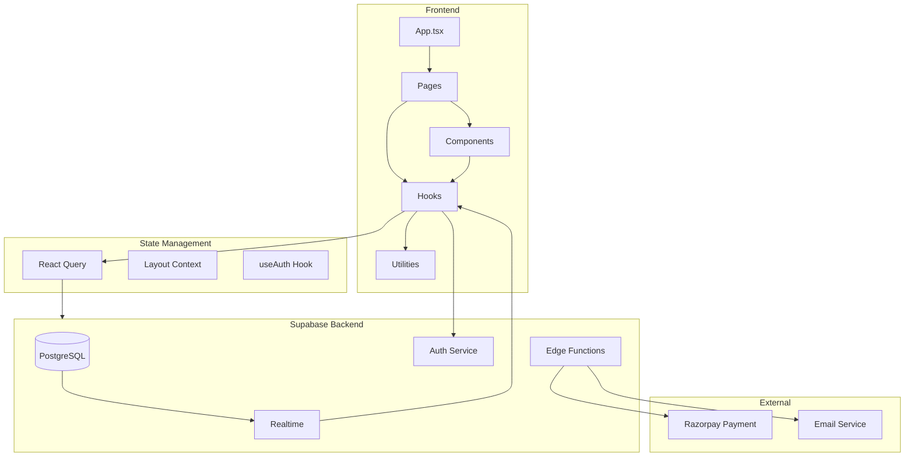

# BuyAPixel - Complete Codebase Documentation

A comprehensive documentation of every file in the BuyAPixel project, explaining responsibilities, usage, and importance within the system.

---

## Project Overview

**BuyAPixel** is a React 18 + TypeScript web application that enables users to purchase, manage, and trade virtual pixels on a 100x100 grid canvas. Users can buy pixels, upload images, list pixels on a marketplace, and interact with other users through a gamified leaderboard system.

### Tech Stack
| Category | Technology |
|----------|------------|
| Frontend | React 18, TypeScript, Vite |
| Styling | Tailwind CSS, shadcn/ui, Radix UI |
| State Management | React Query (TanStack) |
| Backend | Supabase (PostgreSQL + Auth + Realtime) |
| Routing | React Router v6 |
| Forms | React Hook Form + Zod |
| Charts | Recharts |

---

## Root Configuration Files

### [package.json](file:///c:/Users/cshar/Desktop/BuyAPixel/package.json)
**Responsibility:** Defines project dependencies, scripts, and metadata.

| Script | Purpose |
|--------|---------|
| `dev` | Starts Vite development server |
| `build` | Production build with Vite |
| `lint` | Runs ESLint |
| `preview` | Preview production build |

**Key Dependencies:**
- **@supabase/supabase-js** - Backend integration
- **@tanstack/react-query** - Server state management
- **react-router-dom** - Client-side routing
- **lucide-react** - Icon library
- **react-hook-form + zod** - Form handling and validation
- **recharts** - Data visualization

---

### [vite.config.ts](file:///c:/Users/cshar/Desktop/BuyAPixel/vite.config.ts)
**Responsibility:** Vite build configuration with code splitting optimization.

**Key Features:**
- Path alias `@` → `./src`
- **Manual chunk splitting** for optimal loading:
  - `react-vendor` - React core
  - `supabase` - Backend client
  - `ui-core` - Radix UI components
  - `forms` - Form handling libraries
  - `charts` - Recharts (admin/leaderboard only)
  - `image-tools` - Image cropping

**Importance:** Critical for production performance; enables tree-shaking and parallel chunk loading.

---

### [tailwind.config.ts](file:///c:/Users/cshar/Desktop/BuyAPixel/tailwind.config.ts)
**Responsibility:** Tailwind CSS configuration with custom design system.

**Custom Extensions:**
- **Pixel-specific colors:** `pixel-grid`, `pixel-available`, `pixel-selected`, `pixel-sold`
- **Custom gradients:** `gradient-primary`, `gradient-hero`, `gradient-card`
- **Premium shadows:** `shadow-glow`, `shadow-elegant`, `shadow-premium`
- **Animations:** `fade-in`, `scale-in`, `float`, `pulse-glow`

**Importance:** Centralizes styling tokens for consistent design language across the app.

---

### [tsconfig.json](file:///c:/Users/cshar/Desktop/BuyAPixel/tsconfig.json) / [tsconfig.app.json](file:///c:/Users/cshar/Desktop/BuyAPixel/tsconfig.app.json) / [tsconfig.node.json](file:///c:/Users/cshar/Desktop/BuyAPixel/tsconfig.node.json)
**Responsibility:** TypeScript compiler configuration.
- Strict type checking enabled
- Path aliasing for `@/*` imports
- Separate configs for app code and Node.js (Vite config)

---

### [index.html](file:///c:/Users/cshar/Desktop/BuyAPixel/index.html)
**Responsibility:** Single HTML entry point for the SPA.
- Contains root `<div id="root">` for React mounting
- SEO meta tags and favicon references

---

### [eslint.config.js](file:///c:/Users/cshar/Desktop/BuyAPixel/eslint.config.js)
**Responsibility:** ESLint configuration for code quality.
- React hooks rules
- React refresh plugin for HMR

---

### [postcss.config.js](file:///c:/Users/cshar/Desktop/BuyAPixel/postcss.config.js)
**Responsibility:** PostCSS configuration for Tailwind CSS processing.

---

### [components.json](file:///c:/Users/cshar/Desktop/BuyAPixel/components.json)
**Responsibility:** shadcn/ui component library configuration.
- Defines component installation paths and styling preferences

---

## Source Directory (`src/`)

### Entry Points

#### [main.tsx](file:///c:/Users/cshar/Desktop/BuyAPixel/src/main.tsx)
**Responsibility:** Application bootstrap entry point.

```tsx
createRoot(document.getElementById("root")!).render(<App />);
```

**Importance:** Minimal entry that mounts the React root. Imports global CSS.

---

#### [App.tsx](file:///c:/Users/cshar/Desktop/BuyAPixel/src/App.tsx)
**Responsibility:** Root application component with providers and routing.

**Provider Hierarchy:**
1. `QueryClientProvider` - React Query for server state
2. `HelmetProvider` - SEO meta tag management
3. `TooltipProvider` - Global tooltip accessibility
4. `LayoutProvider` - Ticker visibility context
5. `BrowserRouter` - Client-side routing

**Lazy Loading Strategy:**
- **Static imports** (critical path): `BuyPixels`, `SignIn`, `SignUp`, `NotFound`
- **Lazy imports** (on demand): Admin, Profile, Marketplace, Blog, etc.

**Routes:**
| Path | Component | Description |
|------|-----------|-------------|
| `/` | BuyPixels | Main pixel purchase page |
| `/admin` | AdminDashboard | Admin control panel |
| `/profile` | Profile | User profile page |
| `/marketplace` | MarketplacePage | Pixel trading marketplace |
| `/leaderboard` | Leaderboard | User rankings |
| `/blog` | Blog | Blog listing |
| `/signin`, `/signup` | Auth pages | Authentication |

**Key Features:**
- Offline detection with `OfflineBanner`
- Network quality warnings for slow connections
- Error boundary for graceful error handling

---

#### [index.css](file:///c:/Users/cshar/Desktop/BuyAPixel/src/index.css)
**Responsibility:** Global CSS with CSS variable definitions.
- Theme color variables (light/dark mode)
- Base Tailwind directives
- Custom utility classes

---

#### [App.css](file:///c:/Users/cshar/Desktop/BuyAPixel/src/App.css)
**Responsibility:** Application-specific global styles.

---

#### [vite-env.d.ts](file:///c:/Users/cshar/Desktop/BuyAPixel/src/vite-env.d.ts)
**Responsibility:** TypeScript declarations for Vite environment types.

---

## Types (`src/types/`)

### [grid.ts](file:///c:/Users/cshar/Desktop/BuyAPixel/src/types/grid.ts)
**Responsibility:** Core pixel grid type definitions.

| Type | Purpose |
|------|---------|
| `SelectedPixel` | Pixel being selected for purchase (x, y, price, id) |
| `PurchasedPixel` | Pixel owned by a user with metadata (image_url, link_url, block_id) |
| `PixelBlock` | Group of purchased pixels with merged image |

**Importance:** Foundation for grid rendering and pixel management logic.

---

### [profile.ts](file:///c:/Users/cshar/Desktop/BuyAPixel/src/types/profile.ts)
**Responsibility:** User profile and stats type definitions.

| Type | Purpose |
|------|---------|
| `Profile` | User profile data (name, phone, avatar, statistics) |
| `UserPixel` | User's owned pixel with purchase history |
| `PixelStats` | Aggregated pixel statistics |
| `ProfileCompletionData` | Profile completion percentage calculator |

---

### [marketplace.ts](file:///c:/Users/cshar/Desktop/BuyAPixel/src/types/marketplace.ts)
**Responsibility:** Marketplace trading type definitions.

| Type | Purpose |
|------|---------|
| `MarketplaceListing` | Listed pixel with price, status, seller info |
| `MarketplaceTransaction` | Sale transaction with fees |
| `MarketplaceStats` | Marketplace analytics |

---

## Hooks (`src/hooks/`)

### [useAuth.ts](file:///c:/Users/cshar/Desktop/BuyAPixel/src/hooks/useAuth.ts)
**Responsibility:** Authentication state management.

**Returns:**
- `user` - Current user object
- `session` - Supabase session
- `loading` - Auth loading state
- `signOut()` - Logout function
- `isAuthenticated` - Boolean auth check

**Importance:** Central auth source used across protected pages.

---

### [usePixelGridData.ts](file:///c:/Users/cshar/Desktop/BuyAPixel/src/hooks/usePixelGridData.ts)
**Responsibility:** Fetches and manages all purchased pixels with real-time updates.

**Features:**
- **Batch loading** - Loads 5000 pixels at a time
- **Progress tracking** - `loadProgress` (0-100%)
- **Spatial indexing** - Uses `SpatialIndex` for O(1) lookups
- **Realtime subscription** - Auto-updates on pixel changes

**Returns:**
- `purchasedPixels` - All purchased pixels array
- `spatialIndex` - Spatial query data structure
- `isLoading`, `error`, `loadProgress`

**Importance:** Core data hook for the pixel grid - critical for performance.

---

### [useGridInteraction.ts](file:///c:/Users/cshar/Desktop/BuyAPixel/src/hooks/useGridInteraction.ts)
**Responsibility:** Handles grid pan, zoom, and touch interactions.

**Features:**
- Mouse wheel zoom with focal point preservation
- Pinch-to-zoom for mobile
- Touch panning with inertia
- Responsive resizing

**Returns:**
- `offset` - Current pan position
- `handleMouseDown/Up/Move` - Mouse event handlers
- `containerSize` - Current viewport dimensions

---

### [useProfile.ts](file:///c:/Users/cshar/Desktop/BuyAPixel/src/hooks/useProfile.ts)
**Responsibility:** Fetches and caches user profile data.

---

### [useIsAdmin.ts](file:///c:/Users/cshar/Desktop/BuyAPixel/src/hooks/useIsAdmin.ts)
**Responsibility:** Checks if current user has admin privileges.

---

### [useNetworkStatus.ts](file:///c:/Users/cshar/Desktop/BuyAPixel/src/hooks/useNetworkStatus.ts)
**Responsibility:** Monitors network connectivity and quality.

**Returns:**
- `isOnline` - Internet connection status
- `connectionQuality` - '4g', '3g', '2g', 'slow-2g'

---

### [useQRScanner.ts](file:///c:/Users/cshar/Desktop/BuyAPixel/src/hooks/useQRScanner.ts)
**Responsibility:** Camera-based QR code scanning functionality.

---

### [use-mobile.tsx](file:///c:/Users/cshar/Desktop/BuyAPixel/src/hooks/use-mobile.tsx)
**Responsibility:** Detects mobile viewport for responsive layouts.

---

### [use-toast.ts](file:///c:/Users/cshar/Desktop/BuyAPixel/src/hooks/use-toast.ts)
**Responsibility:** Toast notification system (shadcn/ui).

---

## Utilities (`src/utils/`)

### [SpatialIndex.ts](file:///c:/Users/cshar/Desktop/BuyAPixel/src/utils/SpatialIndex.ts)
**Responsibility:** High-performance spatial data structure for pixel lookups.

**Methods:**
- `add(pixel)` - Add pixel to index
- `get(x, y)` - O(1) lookup by coordinates
- `has(x, y)` - Check existence
- `query(x, y, w, h)` - Viewport query for visible pixels

**Implementation:** Chunk-based indexing (10x10 chunks) with hash map for individual lookups.

**Importance:** Critical for rendering performance - enables virtualized grid rendering.

---

### [gridConstants.ts](file:///c:/Users/cshar/Desktop/BuyAPixel/src/utils/gridConstants.ts)
**Responsibility:** Grid configuration constants.

```ts
GRID_CONFIG = {
  CANVAS_WIDTH: 100,
  CANVAS_HEIGHT: 100,
  PIXEL_SIZE: 4,
  CHUNK_SIZE: 10
}
```

---

### [imageOptimization.ts](file:///c:/Users/cshar/Desktop/BuyAPixel/src/utils/imageOptimization.ts)
**Responsibility:** Image URL transformation for CDN optimization.

**Functions:**
- `getGridImageUrl()` - Optimized images for grid display
- `getBillboardImageUrl()` - High-res images for preview

---

### [qrUtils.ts](file:///c:/Users/cshar/Desktop/BuyAPixel/src/utils/qrUtils.ts)
**Responsibility:** QR code generation and parsing utilities.

---

### [vcardUtils.ts](file:///c:/Users/cshar/Desktop/BuyAPixel/src/utils/vcardUtils.ts)
**Responsibility:** vCard contact file generation for pixel sharing.

---

### [dateUtils.ts](file:///c:/Users/cshar/Desktop/BuyAPixel/src/utils/dateUtils.ts)
**Responsibility:** Date formatting helpers.

---

### [stringUtils.ts](file:///c:/Users/cshar/Desktop/BuyAPixel/src/utils/stringUtils.ts)
**Responsibility:** String manipulation utilities.

---

## Contexts (`src/contexts/`)

### [LayoutContext.tsx](file:///c:/Users/cshar/Desktop/BuyAPixel/src/contexts/LayoutContext.tsx)
**Responsibility:** Manages layout state across the application.

**State:**
- `isTickerVisible` - Controls LiveTicker visibility

**Usage:** Allows components to show/hide the ticker (e.g., during fullscreen mode).

---

## Integrations (`src/integrations/`)

### [supabase/client.ts](file:///c:/Users/cshar/Desktop/BuyAPixel/src/integrations/supabase/client.ts)
**Responsibility:** Supabase client initialization and configuration.

**Features:**
- PKCE OAuth flow for security
- Session persistence in localStorage
- Auto token refresh

**Importance:** Single source of truth for all Supabase operations.

---

### [supabase/types.ts](file:///c:/Users/cshar/Desktop/BuyAPixel/src/integrations/supabase/types.ts)
**Responsibility:** Auto-generated TypeScript types from Supabase schema.

**Contains:**
- Database table types
- RPC function signatures
- Enum definitions

---

## Library (`src/lib/`)

### [utils.ts](file:///c:/Users/cshar/Desktop/BuyAPixel/src/lib/utils.ts)
**Responsibility:** Generic utility functions.

**Functions:**
- `cn()` - Class name merging (clsx + tailwind-merge)
- `getErrorMessage()` - Safe error message extraction

---

## Pages (`src/pages/`)

### [BuyPixels.tsx](file:///c:/Users/cshar/Desktop/BuyAPixel/src/pages/BuyPixels.tsx)
**Responsibility:** Main pixel purchasing page - the core experience.

**Features:**
- Interactive pixel grid with selection
- Selection history with undo/redo
- Draft saving with auto-recovery
- Purchase preview and checkout
- Keyboard shortcuts (Ctrl+Z, Ctrl+Y, Escape)

**Components Used:**
- `VirtualizedPixelGrid`
- `EnhancedSelectionSummary`
- `PurchasePreview`
- `QuickSelectTools`

**Importance:** Primary revenue-generating page; most complex UI.

---

### [Canvas.tsx](file:///c:/Users/cshar/Desktop/BuyAPixel/src/pages/Canvas.tsx)
**Responsibility:** Read-only view of the pixel canvas.

**Features:**
- View all purchased pixels
- No purchasing capability
- Optimized for viewing/sharing

---

### [AdminDashboard.tsx](file:///c:/Users/cshar/Desktop/BuyAPixel/src/pages/AdminDashboard.tsx)
**Responsibility:** Comprehensive admin control panel (~2400 lines).

**Tabs:**
- **Dashboard** - Analytics and statistics with charts
- **Users** - User management (block, unblock, delete)
- **Pixels** - Pixel management
- **Marketplace** - Listing moderation
- **Blog** - Blog post management
- **Announcements** - Broadcast messaging
- **Audit Logs** - Action tracking
- **Admin Access** - Grant/revoke admin privileges

**Importance:** Critical for platform management and moderation.

---

### [Profile.tsx](file:///c:/Users/cshar/Desktop/BuyAPixel/src/pages/Profile.tsx)
**Responsibility:** User profile page.

**Sections:**
- Profile completion indicator
- Owned pixels grid
- Statistics dashboard
- Trophy case / achievements
- Profile editing

---

### [MarketplacePage.tsx](file:///c:/Users/cshar/Desktop/BuyAPixel/src/pages/MarketplacePage.tsx)
**Responsibility:** Pixel trading marketplace.

**Features:**
- Browse active listings
- Filter by price/date
- Purchase listed pixels
- List owned pixels for sale

---

### [Leaderboard.tsx](file:///c:/Users/cshar/Desktop/BuyAPixel/src/pages/Leaderboard.tsx)
**Responsibility:** User rankings and gamification.

**Rankings:**
- Most pixels owned
- Highest spending
- Most resales
- Daily/weekly/all-time filters

---

### [SignIn.tsx](file:///c:/Users/cshar/Desktop/BuyAPixel/src/pages/SignIn.tsx) / [SignUp.tsx](file:///c:/Users/cshar/Desktop/BuyAPixel/src/pages/SignUp.tsx)
**Responsibility:** Authentication pages.

**Features:**
- Email/password authentication
- Form validation with Zod
- Error handling for existing accounts

---

### [ForgotPassword.tsx](file:///c:/Users/cshar/Desktop/BuyAPixel/src/pages/ForgotPassword.tsx) / [ResetPassword.tsx](file:///c:/Users/cshar/Desktop/BuyAPixel/src/pages/ResetPassword.tsx)
**Responsibility:** Password recovery flow.

---

### [AuthCallback.tsx](file:///c:/Users/cshar/Desktop/BuyAPixel/src/pages/AuthCallback.tsx)
**Responsibility:** OAuth callback handler for social logins.

---

### [Blog.tsx](file:///c:/Users/cshar/Desktop/BuyAPixel/src/pages/Blog.tsx) / [BlogPost.tsx](file:///c:/Users/cshar/Desktop/BuyAPixel/src/pages/BlogPost.tsx) / [BlogAdmin.tsx](file:///c:/Users/cshar/Desktop/BuyAPixel/src/pages/BlogAdmin.tsx)
**Responsibility:** Blog system.

- `Blog.tsx` - Blog listing page
- `BlogPost.tsx` - Individual post view
- `BlogAdmin.tsx` - Blog CMS for admins

---

### [ScanPixel.tsx](file:///c:/Users/cshar/Desktop/BuyAPixel/src/pages/ScanPixel.tsx)
**Responsibility:** QR code scanner for pixel discovery.

**Features:**
- Camera-based QR scanning
- Pixel lookup by coordinates
- Owner information display

---

### [Contact.tsx](file:///c:/Users/cshar/Desktop/BuyAPixel/src/pages/Contact.tsx)
**Responsibility:** Contact form page.
- Sends emails via Supabase Edge Function

---

### [Help.tsx](file:///c:/Users/cshar/Desktop/BuyAPixel/src/pages/Help.tsx)
**Responsibility:** FAQ and help documentation.

---

### [Index.tsx](file:///c:/Users/cshar/Desktop/BuyAPixel/src/pages/Index.tsx)
**Responsibility:** About page with project information.

---

### [NotFound.tsx](file:///c:/Users/cshar/Desktop/BuyAPixel/src/pages/NotFound.tsx)
**Responsibility:** 404 error page.

---

### [TermsOfService.tsx](file:///c:/Users/cshar/Desktop/BuyAPixel/src/pages/TermsOfService.tsx) / [PrivacyPolicy.tsx](file:///c:/Users/cshar/Desktop/BuyAPixel/src/pages/PrivacyPolicy.tsx)
**Responsibility:** Legal pages.

---

## Components (`src/components/`)

### Core Grid Components

#### [VirtualizedPixelGrid.tsx](file:///c:/Users/cshar/Desktop/BuyAPixel/src/components/VirtualizedPixelGrid.tsx)
**Responsibility:** The heart of the application - renders the 100x100 pixel grid.

**Features:**
- **Canvas-based rendering** for performance
- **Viewport culling** - Only renders visible pixels
- **Block merging** - Displays merged images for block purchases
- **Touch and mouse support**
- **MiniMap integration**
- **Tooltip on hover**

**Performance Optimizations:**
- Uses `SpatialIndex` for O(1) pixel lookups
- RequestAnimationFrame for smooth rendering
- Memoized calculations

**Importance:** Most performance-critical component; handles 10,000 potential pixels.

---

#### [MiniMap.tsx](file:///c:/Users/cshar/Desktop/BuyAPixel/src/components/MiniMap.tsx)
**Responsibility:** Navigation mini-map for the pixel grid.

**Features:**
- Overview of entire canvas
- Viewport indicator
- Click-to-navigate

---

#### [PixelTooltip.tsx](file:///c:/Users/cshar/Desktop/BuyAPixel/src/components/PixelTooltip.tsx)
**Responsibility:** Displays pixel information on hover.

---

### Selection & Purchase Components

#### [EnhancedSelectionSummary.tsx](file:///c:/Users/cshar/Desktop/BuyAPixel/src/components/EnhancedSelectionSummary.tsx)
**Responsibility:** Shows current pixel selection with pricing.

---

#### [PurchasePreview.tsx](file:///c:/Users/cshar/Desktop/BuyAPixel/src/components/PurchasePreview.tsx)
**Responsibility:** Purchase confirmation dialog with image upload.

**Features:**
- Image cropper integration
- Link URL input
- Payment processing

---

#### [QuickSelectTools.tsx](file:///c:/Users/cshar/Desktop/BuyAPixel/src/components/QuickSelectTools.tsx)
**Responsibility:** Selection helper tools.

**Tools:**
- Rectangle select
- Line select
- Fill tool
- Pre-defined shapes

---

### Layout Components

#### [Header.tsx](file:///c:/Users/cshar/Desktop/BuyAPixel/src/components/Header.tsx)
**Responsibility:** Main navigation header.

**Features:**
- Responsive navigation menu
- User authentication state display
- Mobile hamburger menu

---

#### [Footer.tsx](file:///c:/Users/cshar/Desktop/BuyAPixel/src/components/Footer.tsx)
**Responsibility:** Site footer with links and social media.

---

#### [LiveTicker.tsx](file:///c:/Users/cshar/Desktop/BuyAPixel/src/components/LiveTicker.tsx)
**Responsibility:** Real-time activity ticker.

**Features:**
- Live purchase notifications
- Scrolling animation
- Supabase realtime subscription

---

#### [MobileBottomNav.tsx](file:///c:/Users/cshar/Desktop/BuyAPixel/src/components/MobileBottomNav.tsx)
**Responsibility:** Mobile bottom navigation bar.

---

#### [MobileCanvasPanel.tsx](file:///c:/Users/cshar/Desktop/BuyAPixel/src/components/MobileCanvasPanel.tsx)
**Responsibility:** Mobile-optimized canvas controls.

---

### Image Handling

#### [ImageUpload.tsx](file:///c:/Users/cshar/Desktop/BuyAPixel/src/components/ImageUpload.tsx)
**Responsibility:** Image file upload with validation.

---

#### [ImageCropper.tsx](file:///c:/Users/cshar/Desktop/BuyAPixel/src/components/ImageCropper.tsx)
**Responsibility:** Image cropping interface.

**Features:**
- Aspect ratio enforcement
- Zoom and pan
- Preview

---

#### [ContentImageManager.tsx](file:///c:/Users/cshar/Desktop/BuyAPixel/src/components/ContentImageManager.tsx)
**Responsibility:** Manages uploaded content images.

---

### User Components

#### [ProfileEditModal.tsx](file:///c:/Users/cshar/Desktop/BuyAPixel/src/components/ProfileEditModal.tsx)
**Responsibility:** Profile editing dialog.

---

#### [EnhancedStatsPanel.tsx](file:///c:/Users/cshar/Desktop/BuyAPixel/src/components/EnhancedStatsPanel.tsx)
**Responsibility:** User statistics dashboard.

---

#### [TrophyCase.tsx](file:///c:/Users/cshar/Desktop/BuyAPixel/src/components/TrophyCase.tsx)
**Responsibility:** Achievement display component.

---

### Marketplace Components

#### [Marketplace.tsx](file:///c:/Users/cshar/Desktop/BuyAPixel/src/components/Marketplace.tsx)
**Responsibility:** Marketplace listing grid.

---

#### [SharePixelDialog.tsx](file:///c:/Users/cshar/Desktop/BuyAPixel/src/components/SharePixelDialog.tsx)
**Responsibility:** Share pixel via QR code or link.

---

#### [EditPixelDialog.tsx](file:///c:/Users/cshar/Desktop/BuyAPixel/src/components/EditPixelDialog.tsx)
**Responsibility:** Edit owned pixel properties.

---

### Utility Components

#### [ErrorBoundary.tsx](file:///c:/Users/cshar/Desktop/BuyAPixel/src/components/ErrorBoundary.tsx)
**Responsibility:** Catches and displays React errors gracefully.

---

#### [OfflineBanner.tsx](file:///c:/Users/cshar/Desktop/BuyAPixel/src/components/OfflineBanner.tsx)
**Responsibility:** Offline status notification.

---

#### [OnboardingTutorial.tsx](file:///c:/Users/cshar/Desktop/BuyAPixel/src/components/OnboardingTutorial.tsx)
**Responsibility:** First-time user tutorial.

---

#### [FloatingActionButton.tsx](file:///c:/Users/cshar/Desktop/BuyAPixel/src/components/FloatingActionButton.tsx)
**Responsibility:** Mobile floating action button.

---

#### [EnhancedCanvasControls.tsx](file:///c:/Users/cshar/Desktop/BuyAPixel/src/components/EnhancedCanvasControls.tsx)
**Responsibility:** Zoom and pan controls for the grid.

---

#### [EnhancedHeroSection.tsx](file:///c:/Users/cshar/Desktop/BuyAPixel/src/components/EnhancedHeroSection.tsx)
**Responsibility:** Homepage hero section.

---

#### [HowItWorks.tsx](file:///c:/Users/cshar/Desktop/BuyAPixel/src/components/HowItWorks.tsx)
**Responsibility:** Feature explanation section.

---

#### [StaticPixelPreview.tsx](file:///c:/Users/cshar/Desktop/BuyAPixel/src/components/StaticPixelPreview.tsx)
**Responsibility:** Static pixel grid preview image.

---

#### [mode-toggle.tsx](file:///c:/Users/cshar/Desktop/BuyAPixel/src/components/mode-toggle.tsx)
**Responsibility:** Dark/light mode toggle.

---

#### [theme-provider.tsx](file:///c:/Users/cshar/Desktop/BuyAPixel/src/components/theme-provider.tsx)
**Responsibility:** Theme context provider.

---

### UI Components (`src/components/ui/`)

A comprehensive set of 41 reusable UI components from shadcn/ui:

| Component | Purpose |
|-----------|---------|
| `accordion.tsx` | Expandable content sections |
| `alert-dialog.tsx` | Confirmation dialogs |
| `avatar.tsx` | User avatar display |
| `badge.tsx` | Status badges |
| `button.tsx` | Styled buttons with variants |
| `card.tsx` | Content cards |
| `checkbox.tsx` | Form checkboxes |
| `dialog.tsx` | Modal dialogs |
| `dropdown-menu.tsx` | Dropdown menus |
| `form.tsx` | Form component with validation |
| `input.tsx` | Text inputs |
| `label.tsx` | Form labels |
| `popover.tsx` | Floating content |
| `progress.tsx` | Progress bars |
| `scroll-area.tsx` | Scrollable containers |
| `select.tsx` | Select dropdowns |
| `separator.tsx` | Visual dividers |
| `sheet.tsx` | Slide-out panels |
| `skeleton.tsx` | Loading skeletons |
| `slider.tsx` | Range sliders |
| `switch.tsx` | Toggle switches |
| `table.tsx` | Data tables |
| `tabs.tsx` | Tab navigation |
| `textarea.tsx` | Multi-line inputs |
| `toast.tsx` + `toaster.tsx` | Toast notifications |
| `tooltip.tsx` | Hover tooltips |
| And more... | |

---

### Profile Subcomponents (`src/components/profile/`)

Dedicated profile-related components for better code organization.

---

## Supabase Backend (`supabase/`)

### Edge Functions (`supabase/functions/`)

#### [create-razorpay-order](file:///c:/Users/cshar/Desktop/BuyAPixel/supabase/functions/create-razorpay-order)
**Responsibility:** Creates Razorpay payment orders.

---

#### [verify-razorpay-payment](file:///c:/Users/cshar/Desktop/BuyAPixel/supabase/functions/verify-razorpay-payment)
**Responsibility:** Verifies Razorpay payment signatures.

---

#### [create-marketplace-order](file:///c:/Users/cshar/Desktop/BuyAPixel/supabase/functions/create-marketplace-order)
**Responsibility:** Creates marketplace pixel purchase orders.

---

#### [verify-marketplace-payment](file:///c:/Users/cshar/Desktop/BuyAPixel/supabase/functions/verify-marketplace-payment)
**Responsibility:** Verifies and completes marketplace transactions.

---

#### [send-purchase-confirmation](file:///c:/Users/cshar/Desktop/BuyAPixel/supabase/functions/send-purchase-confirmation)
**Responsibility:** Sends email confirmations after purchases.

---

#### [send-contact-email](file:///c:/Users/cshar/Desktop/BuyAPixel/supabase/functions/send-contact-email)
**Responsibility:** Handles contact form submissions.

---

#### [get_marketplace_stats](file:///c:/Users/cshar/Desktop/BuyAPixel/supabase/functions/get_marketplace_stats)
**Responsibility:** Returns marketplace analytics.

---

### Database Migrations (`supabase/migrations/`)

| Migration | Purpose |
|-----------|---------|
| `000_reset.sql` | Schema reset (dev only) |
| `001_extensions.sql` | PostgreSQL extensions |
| `002_core_tables.sql` | Core tables (pixels, profiles, purchases) |
| `003_marketplace.sql` | Marketplace tables |
| `004_blog.sql` | Blog system tables |
| `005_admin.sql` | Admin functionality |
| `006_announcements.sql` | Announcement system |
| `007_analytics.sql` | Analytics tracking |
| `008_rpc_functions.sql` | PostgreSQL RPC functions |
| `009_triggers.sql` | Database triggers |
| `010_seed.sql` | Initial seed data |
| `011_enhancements.sql` | Feature enhancements |
| `012_lint_fixes.sql` | Linter issue fixes |
| `013_final_lint_cleanup.sql` | Final cleanup |
| `014_final_policy_fixes.sql` | RLS policy fixes |
| `015_payment_integration.sql` | Payment system |
| `016_admin_extras.sql` | Additional admin features |
| `017_enhanced_payment_validation.sql` | Payment security |
| `018_marketplace_payment.sql` | Marketplace payments |
| `019_fix_admin_rpc.sql` | Admin RPC fixes |
| `020_fix_clear_users.sql` | User cleanup fixes |

---

## Public Assets (`public/`)

Contains static assets:
- Favicon
- OG images
- Static images

---

## Architecture Diagram



---

## Key Data Flows

### Pixel Purchase Flow
1. User selects pixels on `VirtualizedPixelGrid`
2. Selection stored in `BuyPixels` state
3. `PurchasePreview` shows summary
4. User uploads image via `ImageCropper`
5. Razorpay order created via Edge Function
6. Payment verified, pixels updated in DB
7. Realtime updates grid for all users

### Marketplace Flow
1. Seller lists pixel via `MarketplacePage`
2. Listing created in `marketplace_listings` table
3. Buyer views and purchases
4. Payment processed, ownership transferred
5. Platform fee deducted, seller credited

---

## Performance Considerations

| Area | Optimization |
|------|-------------|
| Grid Rendering | Canvas-based with viewport culling |
| Data Loading | Batch loading 5000 pixels at a time |
| Lookups | SpatialIndex for O(1) coordinate queries |
| Bundle Size | Manual chunk splitting in Vite |
| Lazy Loading | Pages lazy-loaded on navigation |
| Caching | React Query 5-minute stale time |

---

*Documentation generated for BuyAPixel codebase*
