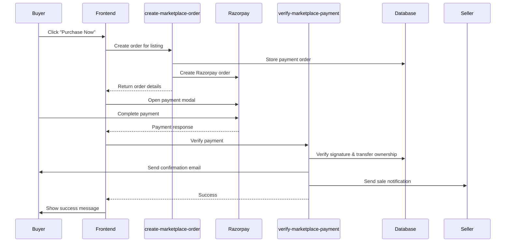

# Payment & Marketplace System Enhancement - Walkthrough

## Summary

Implemented Razorpay payment gateway integration for marketplace purchases. Previously, marketplace transactions transferred ownership without actual payment processing. Now buyers must complete payment before ownership transfers.

## Key Changes

### 1. Database Migration
**File:** [018_marketplace_payment.sql](file:///c:/Users/cshar/Desktop/BuyAPixel/supabase/migrations/018_marketplace_payment.sql)

- Added `purchase_from_marketplace_verified` RPC function
- Implements **5% platform fee** on all marketplace sales
- Calculates `seller_net = sale_price - platform_fee`
- Transfers ownership only after payment verification

### 2. Edge Functions

| Function | Purpose |
|----------|---------|
| [create-marketplace-order](file:///c:/Users/cshar/Desktop/BuyAPixel/supabase/functions/create-marketplace-order/index.ts) | Creates Razorpay order for marketplace listing |
| [verify-marketplace-payment](file:///c:/Users/cshar/Desktop/BuyAPixel/supabase/functions/verify-marketplace-payment/index.ts) | Verifies payment, completes purchase, sends emails |

### 3. Frontend Updates
**File:** [MarketplacePage.tsx](file:///c:/Users/cshar/Desktop/BuyAPixel/src/pages/MarketplacePage.tsx)

- Added Razorpay SDK loading
- Updated purchase flow with payment modal
- Added loading states during payment processing

## Payment Flow



## Platform Fee Structure

| Item | Value |
|------|-------|
| Platform Fee | 5% |
| Example: ₹1000 sale | Platform: ₹50, Seller: ₹950 |

## Email Confirmations

- **Buyer**: Receives marketplace purchase confirmation
- **Seller**: Receives sale notification with earnings breakdown

## Deployment Checklist

> [!IMPORTANT]
> Run these commands to deploy the changes:

```bash
# Deploy database migration
cd c:\Users\cshar\Desktop\BuyAPixel
npx supabase db push

# Deploy edge functions
npx supabase functions deploy create-marketplace-order
npx supabase functions deploy verify-marketplace-payment
```

## Files Created/Modified

| File | Action |
|------|--------|
| `supabase/migrations/018_marketplace_payment.sql` | Created |
| `supabase/functions/create-marketplace-order/index.ts` | Created |
| `supabase/functions/verify-marketplace-payment/index.ts` | Created |
| `src/pages/MarketplacePage.tsx` | Modified |
